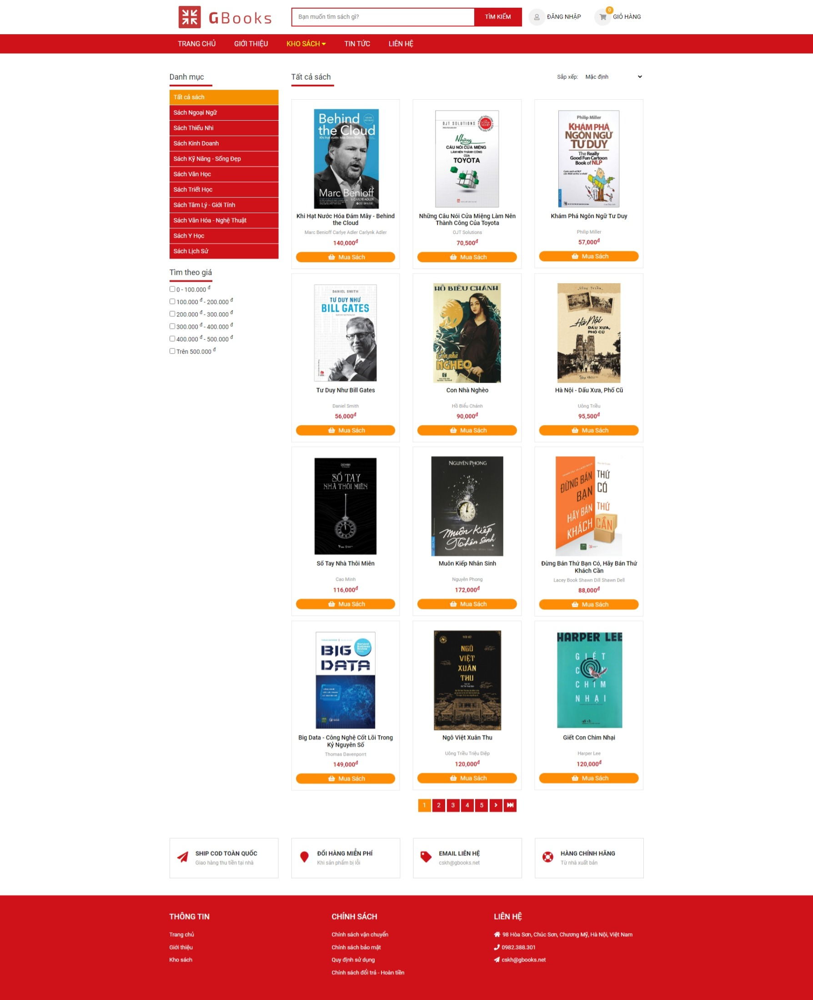
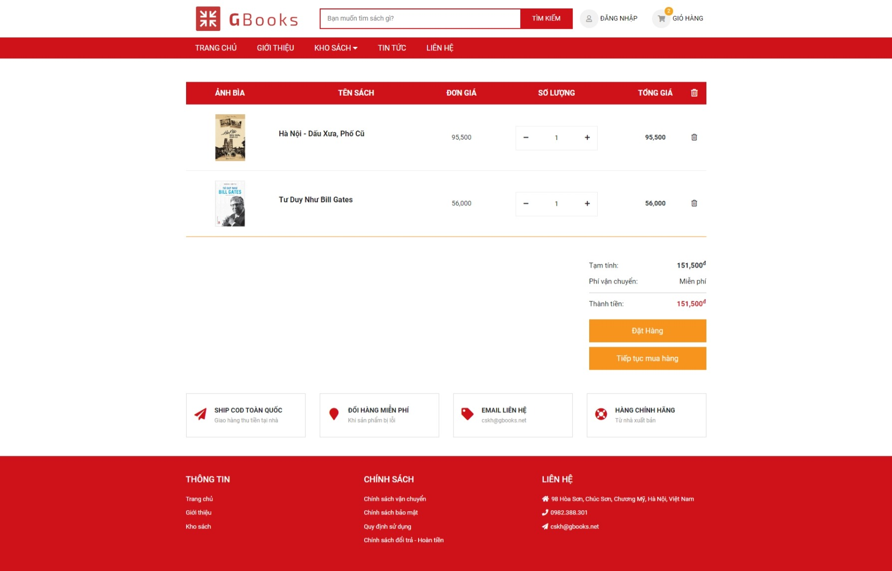

GBooks Online Shopping Store
===================

A book online shopping website using Spring Boot, Spring MVC, Spring Security, JSP, JSTL, Embedded Tomcat and more.

## Technology stack

 - Spring Boot
 - Java 8
 - JSP/JSTL
 - HTML5/CSS3/JavaScript
 - Jquery/AJAX
 - Bootstrap 3

## Spring Features

 - Spring JavaConfig
 - Spring Security
 - Spring MVC
 - Spring Data JPA

## To run this application

Using __Embedded Apache Tomcat__:

	mvn spring-boot:run

You can then access the sample here: [http://localhost:8080/](http://localhost:8080/)

## Homepage

## Books page

## Cart page

## Checkout page

